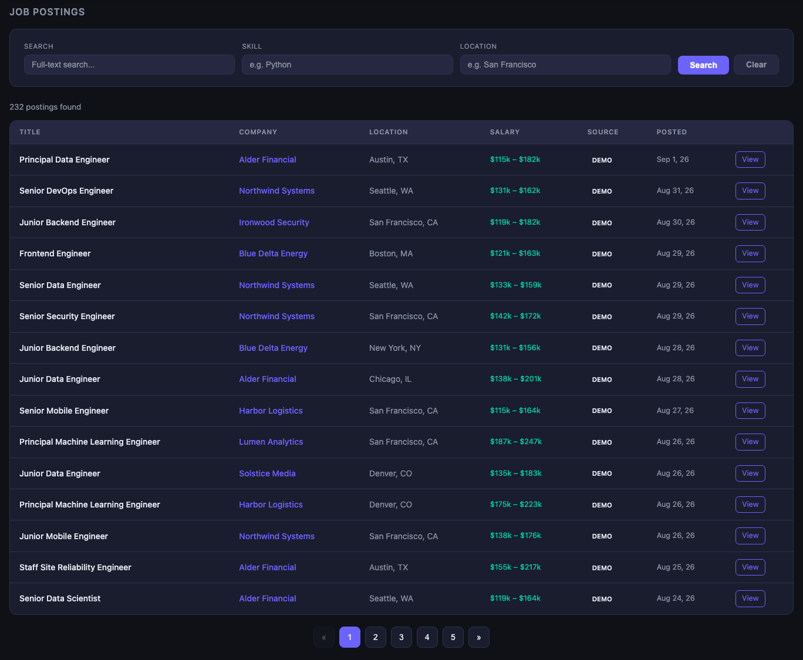
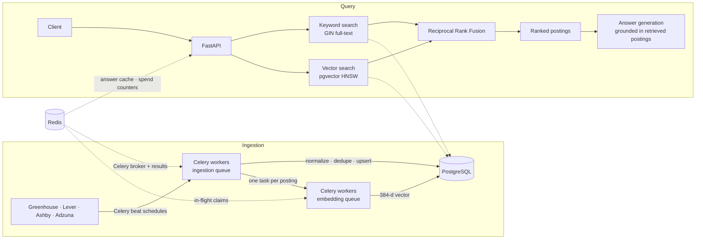

# TalentScope

TalentScope collects software job postings from public job APIs, lets you search them by keyword and by meaning at the same time, and answers job-market questions using — and linking back to — the postings it retrieves.

[](https://github.com/meetsutariya4448/talentscope/actions/workflows/ci.yml)

**Stack:** Python · FastAPI · PostgreSQL (pgvector + full-text search) · Celery · Redis · sentence-transformers · Docker Compose · Prometheus

Job boards match on keywords, so searching "platform engineer" misses a posting titled "Infrastructure Engineer" describing the same work. TalentScope runs keyword and vector similarity search over the same corpus and merges the two ranked lists.

## Show the product

The bundled dashboard reads the same API. Below is its posting browser, rendered from a running instance with the seeded demo corpus (232 postings, 10 companies):



A hybrid query against the same corpus:

```bash
curl "localhost:8000/postings/?q=kubernetes+platform+engineer&mode=hybrid&page_size=2"
```

```json
{
  "total": 213, "page": 1, "pages": 107, "mode": "hybrid",
  "results": [
    { "id": 168, "title": "Platform Engineer", "company_name": "Northwind Systems",
      "location": "Chicago, IL", "salary_min": 127000.0, "salary_max": 154000.0 }
  ]
}
```

```bash
curl -X POST localhost:8000/qa/ask -H 'Content-Type: application/json' \
  -d '{"question":"Which companies are hiring platform engineers, and where?","mode":"hybrid"}'
```

The response carries the answer, a `sources` array of the exact postings used to produce it, and `cited_ids` for any inline `[N]` markers the model emitted. Answers are grounded in the retrieved set by instruction, and markers pointing outside it are discarded.

## How it works



Redis is the Celery broker and result backend, caches generated answers, holds the per-posting claims that stop overlapping backfills embedding the same posting twice, and stores the counters bounding spend on the answer endpoint.

## Engineering highlights

**Hybrid retrieval with source-linked answers.** Keyword and vector results merge via Reciprocal Rank Fusion, ranking by agreement between methods without either silencing the other. Every answer returns the postings it came from.

**Ingestion that tolerates repetition and failure.** Fetch tasks retry with exponential backoff. Ingestion upserts on `(source, source_id)`, so a redelivered task updates a posting rather than duplicating it, and refreshes skill links when a description changes. Tasks exhausting their retries land in a `failed_tasks` table, surviving the Redis result backend's TTL.

**Readiness that reflects what the service can do.** The embedding model loads per process, and readiness previously reported healthy while it was still unloaded — so the first search after a restart paid the load inside the request. It is now warmed at startup, `/ready` fails until that completes, and encoder-dependent paths return 503 with `Retry-After`. Liveness stays dependency-free, so a slow load cannot cause a restart loop ([`evals/coldstart.md`](evals/coldstart.md)).

**Diagnosing inference-thread oversubscription.** A container CPU limit is a cgroup quota `os.cpu_count()` cannot see, so PyTorch sized its thread pool from the host's 10 cores inside a 2-CPU container and spent the quota context-switching.

## Measured performance

Effect of pinning the inference thread pool, at a fixed 2-CPU limit with ingestion running:

| | Baseline (host-sized pool) | Tuned (pinned to quota) | Change |
|---|---|---|---|
| Successful API throughput | 20.7 req/s | **100.1 req/s** | 4.8× |
| p95 latency | 9,239 ms | **665 ms** | 13.9× lower |
| Ingestion | 5.7 postings embedded/s | **29.9 postings embedded/s** | 5.3× |

Medians of five trials per configuration, alternating between them so host background load is shared rather than favouring one. The database was restored from the same snapshot before every trial (1,732 postings). Load was k6 at 60 virtual users for 45 seconds against search and analytics endpoints, with 1,400 embedding tasks queued beforehand and the rate limit removed so CPU was the binding constraint. Resource limits, concurrency, dataset size and image were read back from the containers each trial and were identical; only the thread setting differed.

All 28,335 requests across the ten trials returned 2xx. The slower configuration was slower, not failing.

These are single-host figures from a developer laptop, measuring one setting's effect rather than deployment capacity. Method, per-trial data and limitations: [`evals/thread-ab.md`](evals/thread-ab.md); raw artifacts in [`evals/thread-ab/`](evals/thread-ab/).

## Quick start

Requires Docker. Search needs no credentials; the answer endpoint needs a Groq key.

```bash
git clone https://github.com/meetsutariya4448/talentscope.git
cd talentscope
cp .env.example .env
```

`.env` is gitignored. Leave it unchanged for search only; for answers set `GROQ_API_KEY` (free tier at console.groq.com). `ADZUNA_APP_ID` and `ADZUNA_APP_KEY` are optional, used only by the Adzuna source. If Postgres or Redis already run locally, set `POSTGRES_HOST_PORT` and `REDIS_HOST_PORT` to free ports.

```bash
# Required services only — Prometheus, Grafana and cAdvisor are optional
docker compose up -d --build postgres redis api worker beat

# Migrate, then load and embed a deterministic demo corpus
docker compose exec -T api alembic upgrade head
docker compose exec -T api python scripts/seed_demo.py --embed

# Readiness reports database, Redis and embedding model separately
curl localhost:8000/ready

curl "localhost:8000/postings/?q=kubernetes+platform+engineer&mode=hybrid&page_size=5"
open http://localhost:8000/dashboard/
```

`mode` accepts `fts`, `vector` or `hybrid`. With a key set, `POST /qa/ask` answers questions, bounded by a daily budget and per-client rate limit; exceeding either returns retrieved postings without a generated answer. Add `prometheus grafana cadvisor` to the `up` command for metrics on `:9090` and dashboards on `:3000`. Stop with `docker compose down -v`.

## Testing and scope

**171 tests passed in hosted CI** at commit `3dcb380` on `main` ([run 34087037678](https://github.com/meetsutariya4448/talentscope/actions/runs/34087037678)), against PostgreSQL with pgvector and Redis service containers.

- Ingestion idempotency is tested against real PostgreSQL, not a mock: repeated ingestion, skill links following changed content, dead-letter writes.
- **Broker-level behaviour is not tested.** No test starts a real Celery worker or forces a redelivery, so worker-crash and duplicate-delivery handling under an actual broker is unverified. The at-least-once configuration is present but not demonstrated.
- Benchmarks, recovery drills, Docker builds and infrastructure validation ran locally. CI runs the test suite only — no build, no infrastructure checks, no deploy step.
- Terraform and Kubernetes were exercised against LocalStack and kind: local infrastructure exercises. **No cloud deployment is claimed**; recorded cloud spend is $0.00.

## Further reading

| Document | Contents |
|---|---|
| [`evals/thread-ab.md`](evals/thread-ab.md) | Thread-pinning benchmark: method, per-trial data, limitations |
| [`evals/coldstart.md`](evals/coldstart.md) | Model warmup and readiness gating, measured across a restart |
| [`evals/cpu-budget.md`](evals/cpu-budget.md) | CPU and memory budgeting; why a rate limit capped ingestion |
| [`docs/db-engineering.md`](docs/db-engineering.md) | Index choices with EXPLAIN ANALYZE evidence |
| [`docs/incidents/`](docs/incidents/) | Two recovery drills: data loss to restore, bad deploy to rollback |
| [`docs/observability.md`](docs/observability.md) | Metrics, probe semantics, tracing |
| [`docs/terraform.md`](docs/terraform.md) · [`docs/kubernetes.md`](docs/kubernetes.md) | Infrastructure definitions, and what LocalStack and kind could not exercise |
| [`docs/cost.md`](docs/cost.md) | Running cost, plus a priced estimate for the Terraform topology |

Sources are the Greenhouse, Lever and Ashby job board APIs and the Adzuna aggregator; tracked companies live in [`config/target_companies.yml`](config/target_companies.yml). The demo corpus is generated rather than scraped, so the project runs without live third-party APIs.
